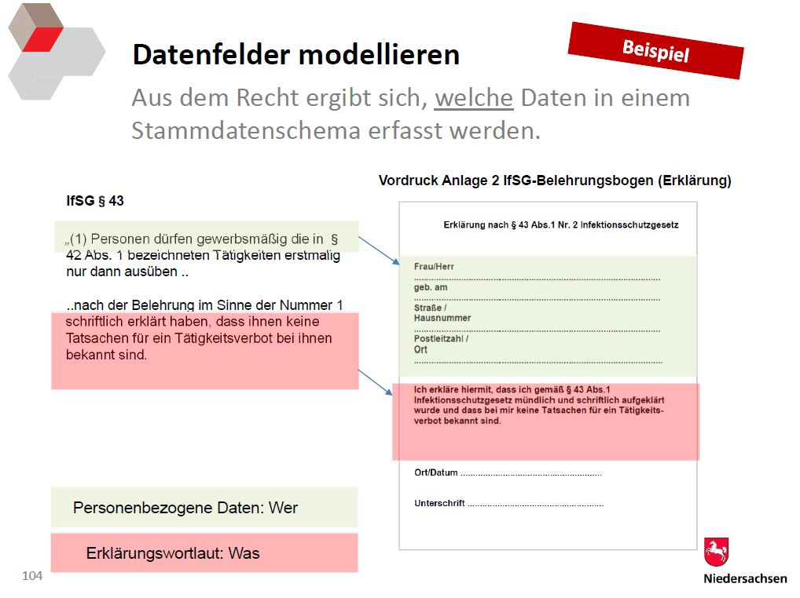
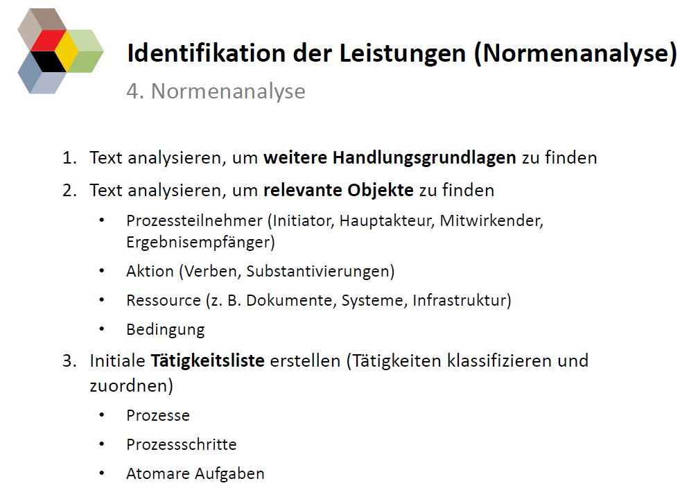

###### Meeting Room
* [Clara's personal Zoom](https://uni-jena-de.zoom.us/j/8481360393?pwd=N3prNzhCcGw0emR4YUY3Nzd0azNKQT09) (Meeting ID: `848 136 0393` Code: `2apzWd`)

# 15.03.22
**Participants:** Jonas, Sina, Clara

## Jonas Onboarding
- Organisational Matters:
	- Gitlab	
	- working hours, weekly meetings (next week in person?)
	- communication via Element
- context: 
	- working group (Bielefeld: 2 Hiwis and 1 WiMi; Jena: 1 WIMI, 1 Hiwi, 1 Bachelorthesis; Simplex: 2 WIMIS)
	- idea behind Canaréno:
		- OZG - Online-Zugangsgesetz
		- FIM - Annotate legal texts using the FIM-Method
 		
		
		
	- problem: no annotated texts available
	- possible solutions: annotate own data, use other learning methods
- currently:
	- Setting up Annotation Tool (Sarah)
	- Crawling Legal Texts (Clara, Sarah) 	
- first tasks: 
	- getting familiar with FIM via [Introduction Material Sachsen-Anhalt](https://ozg.sachsen-anhalt.de/grundlagen/foederales-informationsmanagement-fim/)
		- in case of questions send them to Clara two days in advance of our next meeting 	
	- annotate the crawled legal documents with [this guide](https://blog.codecentric.de/en/2020/11/ner-cli-custom-named-entity-recognition-with-spacy-in-four-lines/)
- Coming up (beginning in April, as soon as Patrick joins us): 
	- three alternative approaches to NER with Machine Learning: Rule-based, semi-supervised, unsupervised
	- first phase: exploring literature
	- second phase: applying promising approaches 	

